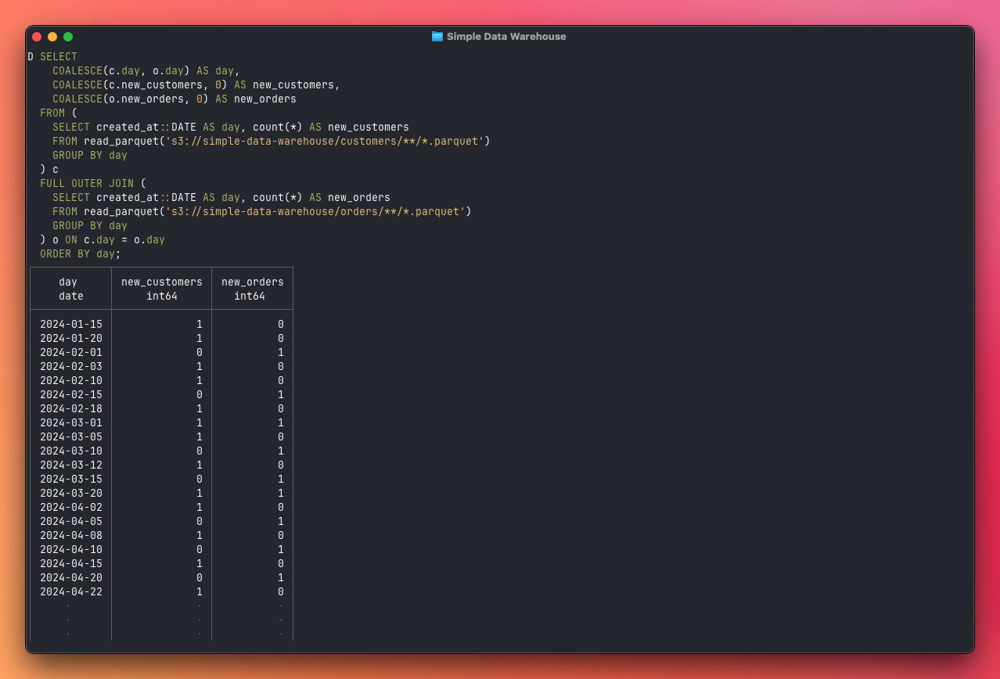

# Simple Data Warehouse



A self-hosted ETL pipeline that extracts customer, order, and event data from
Postgres and writes date-partitioned Parquet files to S3, queryable with DuckDB.

## Prerequisites

- Docker and Docker Compose
- An AWS S3 bucket
- Optionally, [Bun](https://bun.sh) for local development

## Configuration

Copy the example env file and fill in your values:

```sh
cp .env.example .env
```

| Variable                | Description                       |
| ----------------------- | --------------------------------- |
| `DATABASE_URL`          | Postgres connection string        |
| `S3_BUCKET`             | S3 bucket name for Parquet output |
| `S3_REGION`             | AWS region (default: `us-east-1`) |
| `AWS_ACCESS_KEY_ID`     | AWS access key                    |
| `AWS_SECRET_ACCESS_KEY` | AWS secret key                    |

## Running the Pipeline

Start Postgres (seeds automatically on first run):

```sh
docker compose up postgres -d
```

Run the ETL pipeline once:

```sh
docker compose run --rm etl
```

Start the scheduler (runs daily at 3 AM):

```sh
docker compose up scheduler -d
```

To run the pipeline immediately on scheduler start, set `RUN_ON_START=true` in
your `.env`.

## Querying with DuckDB

Start an interactive DuckDB shell using Docker:

```sh
docker run --rm -it --env-file .env datacatering/duckdb:v1.2.2 -unsigned
```

Then configure S3 credentials and query the Parquet files:

```sql
INSTALL httpfs; LOAD httpfs;
SET s3_region = getenv('S3_REGION');
SET s3_access_key_id = getenv('AWS_ACCESS_KEY_ID');
SET s3_secret_access_key = getenv('AWS_SECRET_ACCESS_KEY');

SELECT * FROM read_parquet('s3://my-data-warehouse/customers/2026/02/18.parquet') LIMIT 10;
```

### New customers and orders per day

```sql
SELECT
  COALESCE(c.day, o.day) AS day,
  COALESCE(c.new_customers, 0) AS new_customers,
  COALESCE(o.new_orders, 0) AS new_orders
FROM (
  SELECT created_at::DATE AS day, count(*) AS new_customers
  FROM read_parquet('s3://my-data-warehouse/customers/2026/02/18.parquet')
  GROUP BY day
) c
FULL OUTER JOIN (
  SELECT created_at::DATE AS day, count(*) AS new_orders
  FROM read_parquet('s3://my-data-warehouse/orders/2026/02/18.parquet')
  GROUP BY day
) o ON c.day = o.day
ORDER BY day;
```

See `queries.sql` for more examples.

## Warehouse Structure

```
s3://my-data-warehouse/
  etl.json                          # Run metadata (last_run_at, status, counts)
  customers/2026/02/18.parquet      # Customer data
  orders/2026/02/18.parquet         # Order data
  events/2026/02/18.parquet         # Event data (logins, feature usage, exports)
```

## Local Development

```sh
bun install
bun run pipeline    # Run ETL pipeline
bun run scheduler   # Start scheduler
```
